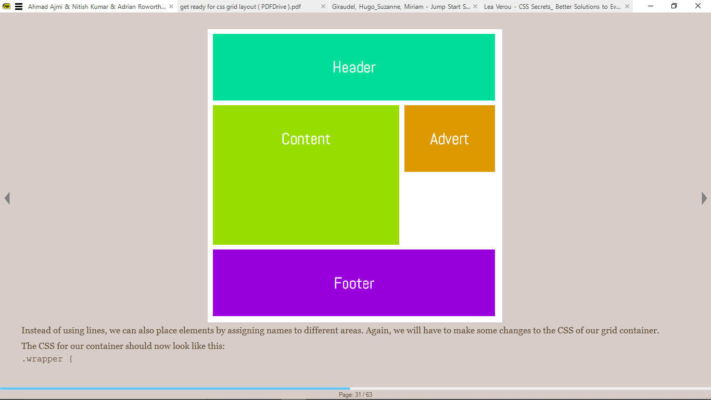
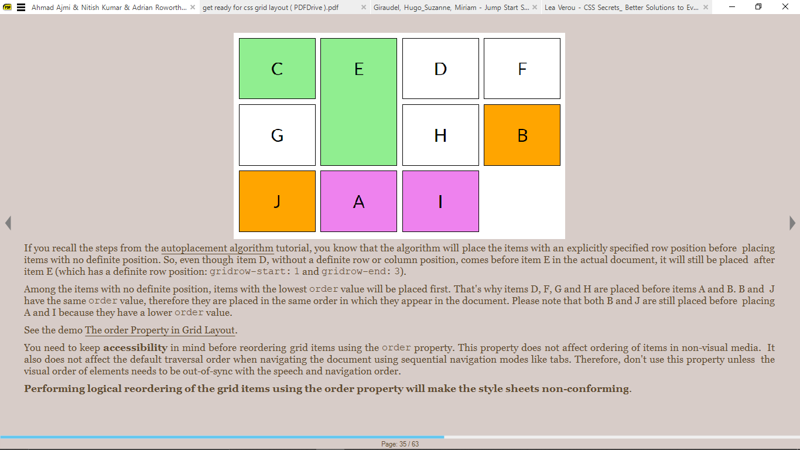

# References
> **Designing with CSS Grid Layout** by *Ahmad Ajmi, Nitish Kumar and Adrian Roworth*
> 
> **Get Ready for CSS Grid Layout** by *Rachel Andrew*


# Introduction
A layout system that allows us to design pages using a 2-d grid.

# Creating a Grid


```html
<div class="app-layout">
  <div class="tweets">Tweets</div>
  <div class="replies">Replies</div>
  <div class="search">Search</div>
  <div class="messages">Messages</div>
</div>
```

```css
.app-layout {
  display: grid;
  grid-template-columns: 1fr 1fr 1fr 1fr; /*The container is divided into four equal columns*/
  grid-template-rows: 100vh;
}
```

Applying `display:grid;` to the element makes it a grid container.

The `grid-template-columns` property specifies the width of each grid column in the grid.

The `grid-template-rows` specifies the height of each grid row.

# Grid Layout Module Concepts

1. **Grid Item**: Children elements of the grid container. E.g `.tweets` and `.replies`

2. **Grid Lines**: Line that exists on either side of a column or row.


# Positioning Grid Items


## Using a Line Number
Can refer to an exact line number in a  grid.

Use the `grid-column-start` and `grid-column-end` properties.

The `grid-row` property which row the targeted element is in. It is shorthand for the `grid-row-start` and `grid-row-end` properties.

The `grid-column` lets you specify both the start and end line in one property.

```css
.tweets {
grid-column-start: 1;
grid-column-end: 2;
grid-row: 1;
}

.tweets {
grid-column: 1 / 2;
grid-row: 1;
}
```

## Using Named Areas
Specified using the  `grid-template-areas` and the `grid-area` properties.

```css
.app-layout {
  display: grid;
  grid-template-columns: 1fr 1fr 1fr 1fr;
  grid-template-rows: 100vh;
  grid-template-areas: "tweets replies search messages";
}

.tweets {
grid-area: tweets;
}

/*Shorthand for grid-area*/
.selector {
  grid-area: row-start / col-start / row-end / col-end;
}
```

```css
.wrapper {
  display: grid;
  grid-gap: 10px;
  grid-template-columns: 180px 180px 180px;
  grid-template-areas: "header header header"
"content content advert"
"content content ..."
"footer footer footer";
}
```

## Using the `span` keyword


Specifies the number of columns or rows a particular element will span.

```css
.selector {
  grid-row: row-start / span row-span-value;
  grid-column: col-start / span col-span-value;
}

.selector {
  grid-row: 1 / span 2;
  grid-column: 1 / span 2;
}
```

## Using Named Lines


# Ordering and Aligning Items

## The `order` property
Used to specify the order in which different should be placed inside a grid.

Very useful when items are added dynamically.

Items with the lowest order value are placed first in the grid. Items with higher values are placed later.

Items with the same order value will appear as they do in the source document.


```html
<div class="item a"></div>
<div class="item b"></div>
<div class="item c"></div>
<div class="item d"></div>
<div class="item e"></div>
<div class="item f"></div>
<div class="item g"></div>
<div class="item h"></div>
<div class="item i"></div>
<div class="item j"></div>
```

```css
.c {
  grid-row-start: 1;
  grid-row-end: 2;
}

.e {
  grid-row-start: 1;
  grid-row-end: 3;
}

.b, .j {
  order: 2;
}

.a. .i {
  order: 3;
}
```

## Aligning Content Along the Row
Use the `justify-self` and `justify-items`.

`justify-self` aligns the content of a single grid item, while `justify-items` aligns all the items in the grid.

Possible values:
1. `end` - aligns to right
2. `start` - aligns to left
3. `center` - aligns to center
4. `stretch`(default) - fills whole width of grid area

## Aligning content along the Column
Use the `align-self` and `align-items`.

Possible values:
1. `end` - aligns to top
2. `start` - aligns to bottom
3. `center` - aligns to center
4. `justify` - fills whole width of grid area

## Aligning the Whole Grid

`justify-content` - row
`align-content` - column

Possible values:
1. `end`
2. `start`
3. `center`
4. `justify`
5. `space-around`
6. `space-between`
7. `space-evenly`