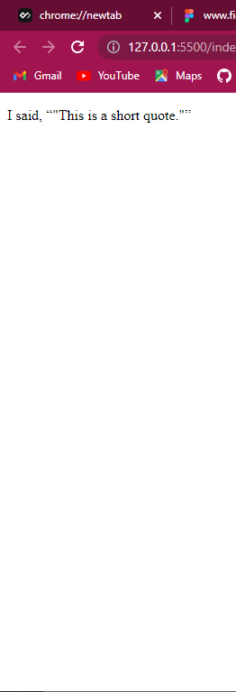
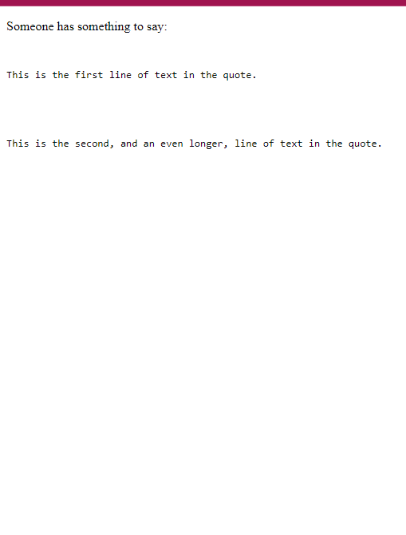
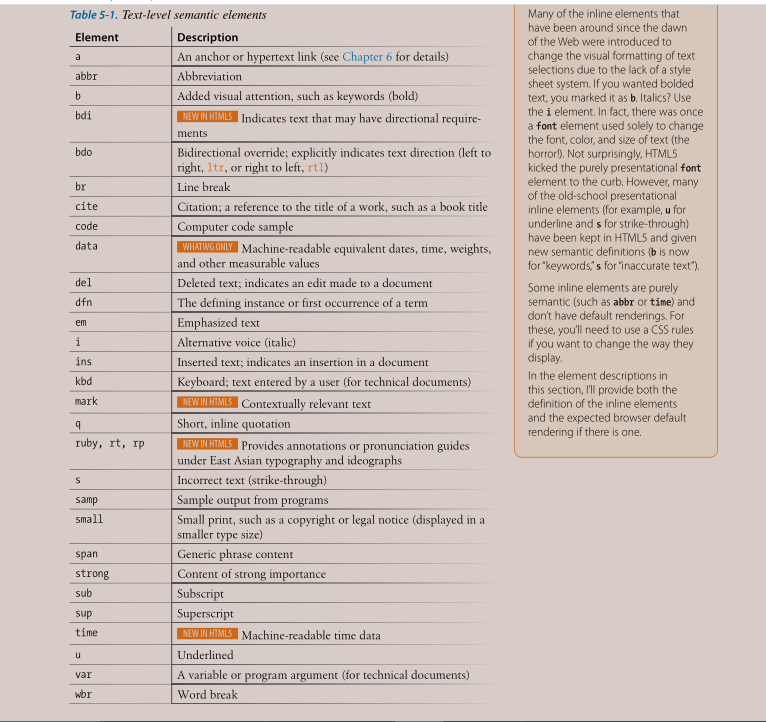
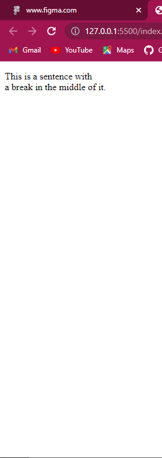
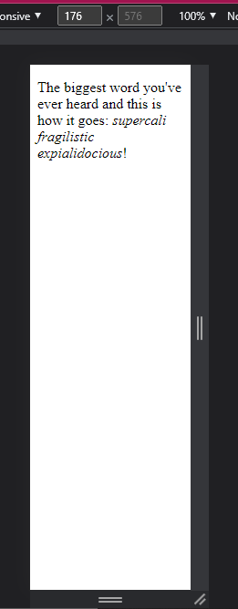
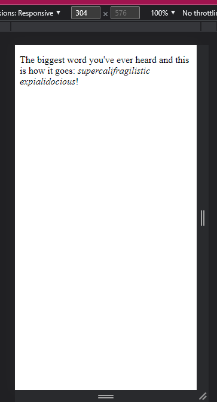
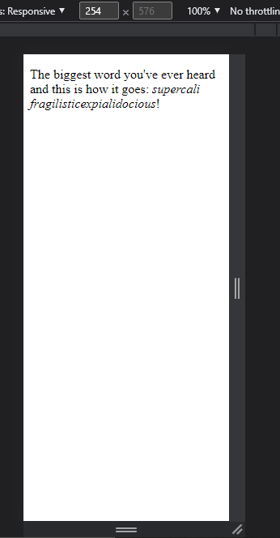
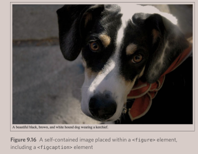
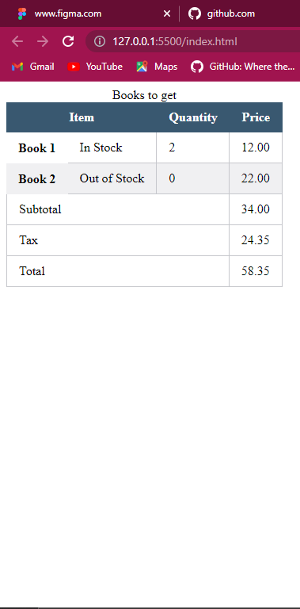

- [References](#references)
- [Introduction](#introduction)
  - [What is HTML?](#what-is-html)
  - [What is HTML5?](#what-is-html5)
  - [HTML: The Living Language](#html-the-living-language)
  - [Principles of HTML5](#principles-of-html5)
  - [Common HTML Terms](#common-html-terms)
    - [How they are used](#how-they-are-used)
  - [Naming Conventions for files](#naming-conventions-for-files)
- [The HTML5 Syntax](#the-html5-syntax)
  - [The HTML Skeleton](#the-html-skeleton)
    - [The Doctype](#the-doctype)
    - [Character Encoding](#character-encoding)
    - [Specifying Language](#specifying-language)
    - [The `<head>` element](#the-head-element)
    - [The `meta` tag](#the-meta-tag)
    - [The `<body>` element](#the-body-element)
  - [Syntax Changes](#syntax-changes)
    - [Loosened Rules](#loosened-rules)
    - [Removed Elements](#removed-elements)
    - [Adapted Elements](#adapted-elements)
  - [Special Characters](#special-characters)
  - [Comments](#comments)
  - [IDs and Classes](#ids-and-classes)
  - [Quirks Mode and Standards Mode](#quirks-mode-and-standards-mode)
  - [Sectioning Roots](#sectioning-roots)
- [All about the elements](#all-about-the-elements)
  - [Block and Inline Elements](#block-and-inline-elements)
  - [Divs and Spans](#divs-and-spans)
  - [Semantic Elements](#semantic-elements)
    - [Structurally-based Elements](#structurally-based-elements)
      - [Header `<header>`](#header-header)
      - [Navigation `<nav>`](#navigation-nav)
      - [Main `<main>`](#main-main)
      - [Article `<article>`](#article-article)
      - [Section `<section>`](#section-section)
      - [Aside `<aside>`](#aside-aside)
      - [Footer `<footer>`](#footer-footer)
      - [Addresses `<address>`](#addresses-address)
    - [Using Text-Based Elements](#using-text-based-elements)
      - [Headings `<h1>` to `<h6>`](#headings-h1-to-h6)
      - [Heading Groups `<hgroup>`](#heading-groups-hgroup)
      - [Paragraphs `<p>`](#paragraphs-p)
      - [Bold Text (`<strong>` and `<em>`)](#bold-text-strong-and-em)
      - [Italic Text (`<em>` and `<i>`)](#italic-text-em-and-i)
      - [Time `<time>`](#time-time)
      - [Figure, `<figure>` and `<figcaption>`](#figure-figure-and-figcaption)
      - [Output `<output>`](#output-output)
      - [Mark `<mark>`](#mark-mark)
      - [Blockquotes `<blockquote>` (for long quotations)](#blockquotes-blockquote-for-long-quotations)
      - [Short quotations `<q>`](#short-quotations-q)
      - [Pre-formatted text `<pre>`](#pre-formatted-text-pre)
      - [Abbreviations `<abbr>`](#abbreviations-abbr)
      - [Citations `<cite>`](#citations-cite)
      - [Defining terms `<dfn>`](#defining-terms-dfn)
      - [Subscript and superscript, `<sub>` and `<sup>`](#subscript-and-superscript-sub-and-sup)
      - [Elements for code](#elements-for-code)
      - [Machine-readable data `<data>`](#machine-readable-data-data)
      - [Inserted and deleted text `<ins>` and `<del>`](#inserted-and-deleted-text-ins-and-del)
    - [Other Elements](#other-elements)
      - [Lists](#lists)
        - [Unordered Lists](#unordered-lists)
        - [Ordered Lists](#ordered-lists)
        - [Description Lists](#description-lists)
      - [Line Breaks `<br>`](#line-breaks-br)
      - [Word Breaks `<wbr>`](#word-breaks-wbr)
      - [Bidirectional override `<bdo>`](#bidirectional-override-bdo)
      - [Bidirectional isolation `<bdi>`](#bidirectional-isolation-bdi)
      - [Elements for East Asian Languages `<ruby>`, `<rt>` and `<rp>`](#elements-for-east-asian-languages-ruby-rt-and-rp)
    - [Other Standards for Semantics](#other-standards-for-semantics)
- [Creating Hyperlinks](#creating-hyperlinks)
  - [The anchor `<a>` element](#the-anchor-a-element)
  - [Linking between files (Relative and Absolute Paths)](#linking-between-files-relative-and-absolute-paths)
  - [Linking within a page](#linking-within-a-page)
  - [Linking Email Addresses](#linking-email-addresses)
  - [Linking Telephone Numbers](#linking-telephone-numbers)
  - [Open Links in a New Window](#open-links-in-a-new-window)
  - [Linking to parts of the same page](#linking-to-parts-of-the-same-page)
- [Web Forms](#web-forms)
  - [Form Controls](#form-controls)
    - [The `action` and `method` attributes](#the-action-and-method-attributes)
    - [Form labels](#form-labels)
    - [Form Inputs](#form-inputs)
    - [Input Attributes](#input-attributes)
      - [Hidden Inputs](#hidden-inputs)
    - [Form Dropdowns](#form-dropdowns)
    - [Progress Bars and Meters](#progress-bars-and-meters)
  - [Form Validation](#form-validation)
    - [Validating in Two Places](#validating-in-two-places)
  - [Turning Validation Off](#turning-validation-off)
    - [Catching Missing Information](#catching-missing-information)
    - [Validation with Regular Expressions](#validation-with-regular-expressions)
    - [Custom Validation](#custom-validation)
- [Creating editable content](#creating-editable-content)
- [HTML Media](#html-media)
  - [Images](#images)
    - [Image Formats](#image-formats)
      - [The `gif` format](#the-gif-format)
      - [The `jpeg` format](#the-jpeg-format)
      - [The `png` format](#the-png-format)
      - [The `svg` format](#the-svg-format)
    - [Image Transparency](#image-transparency)
  - [The `<figure>` element](#the-figure-element)
  - [Audio](#audio)
    - [Audio Fallbacks](#audio-fallbacks)
    - [Audio Formats](#audio-formats)
  - [Video](#video)
    - [Video Fallbacks](#video-fallbacks)
    - [Video Formats/Codecs](#video-formatscodecs)
    - [Video Captions](#video-captions)
      - [Adding Captions to videos](#adding-captions-to-videos)
  - [Media Groups](#media-groups)
- [Tables](#tables)
    - [Table Structure](#table-structure)
  - [Combining Multiple Cells](#combining-multiple-cells)
  - [Table Borders](#table-borders)
    - [For space between borders](#for-space-between-borders)
    - [Adding Borders to Rows](#adding-borders-to-rows)
    - [Table Striping](#table-striping)

# References
> HTML5: The Missing Manual, *2nd Edition* by Matthew MacDonald  
> 
> Learn to Code HTML and CSS: Develop and Style Websites by Shay Howe 
>  
> Learning Web Design: A Beginner's Guide to HTML, CSS, JavaScript and Web Graphics, *4th Edition* by Jennifer Niederst Robbins
> 
>> **All screenshots of the exercises tried out are from the Google Chrome browser, version 104.0.5112.102**

# Introduction

## What is HTML?
HTML stands for the *HyperText Markup Language*.  It is the (markup) language used to create web page documents. 

A markup language is basically used for formatting documents or (web) content. It gives content structure and meaning by adding descriptive tags to the document.

HTML defines text elements that make up documents such as headings, paragraphs, emphasized text, links, etc.

## What is HTML5?
HTML5 is really a web of interrelated standards. 
1. **Core HTML5** - This makes up the official W3C version of the specification. It includes new semantic elements, new and enhanced web form widgets, audio and video support, and the canvas for drawing with JavaScript.
2. **Features that were once HTML5** - Features that sprang form the original HTML5 spec as prepared by the WHATWG. These are mostly specifications for features that require JS and support rich web applications - data storage, offline applications and messaging.
3. **Features that are sometimes called HTMl5** - Next-gen features often lumped together with HTML5, even though they were never a part of the standard - CSS3 and geolocation.

## HTML: The Living Language
This means that an HTML page will never become obsolete and stop working. HTML pages will never use a version number, and developers will never need to 'upgrade' their markup from one version to another.  
By the same token, new features may be added to HTML at any time.

## Principles of HTML5
1. **Don't Break the Web**: A standard shouldn't introduce changes that makes other people's web pages stop working.  
2. **Pave the cowpaths**: HTML5 standardizes unofficial, but widely used techniques.
3. **Be practical**: Changes should have a practical purpose. The more demanding a change, the bigger the payoff needs to be.

## Common HTML Terms
1. **Elements**: Elements consist of both the content and the tags surrounding the content.

2. **Tags**: Tags comprise of the use of less-than and greater-than angle brackets surrounding an element. Tags mostly occur in pairs of opening and closing tags.

3. **Attributes**: Properties used to add additional information about an element. Attributes are defined within the opening tag, after an element's name. They generally include a name an a value. Examples are 
  * `class`: Classifies an element
  * `id`: Identifies an element
  * `src`: Specifies a source for an embeddable content.
  * `href`: Provides a hyperlink reference to a linked resource

### How they are used

```html
<a href="https://google.com">Google</a>
<element-name attribute="attribute-value">Element Content</element-name>
```
* `<a>` - the opening tag
* `a` - element name
* `href` - attribute (the hyperlink reference attribute)
* `https://google.com` - the attribute value
* `Google` - element content
* `</a>` - closing tag

* `<a>...</a>` - element

## Naming Conventions for files
1. Use proper suffixes: HTML and XHTML files must end with `.html`. Web graphics must be labelled according to their format, `.gif`, `.png`, `.jpg`, `.jpeg`, etc.

2. Never use character spaces within filenames: An underline or hyphen is often used to visually seperate words within filenames.

3. Avoid special characters: Filenames should be limited to letters, numbers, underscores, hyphens, and periods.

4. Filenames may be case-sensitive, depending on server configuration: It is preferable to consistently use all lowercase letters in filenames.

5. Keep filenames short, as much as you can. 

# The HTML5 Syntax

## The HTML Skeleton
The simplest HTML5 document you can create
```html
<!DOCTYPE html>
  <title>Document</title>
  <p>Learning to use HTML5</p>
```

This is more fleshed out
```html
<!DOCTYPE html>
<html lang="en">
<head>
  <meta charset="UTF-8">
  <meta http-equiv="X-UA-Compatible" content="IE=edge">
  <meta name="viewport" content="width=device-width, initial-scale=1.0">
  <title>Document</title>
</head>
<body>
  <p>Learning to use HTML5</p>
</body>
</html>
```
### The Doctype
`<!DOCTYPE html>`

The doctype clearly indicates the standard that was used to write the document markup that follows.  It indicates what version of HTML is being used and is placed at the beginning of the HTML document.
Despite the fact that HTML is a living language, the doctype remains. Without a doctype, most browsers will lapse into *quirks mode*, which differs from browser to browser.  
When you add a doctype, the browser recognises that you want to use the stricter standards mode, ensuring consistent formatting and layout on every modern browser.

Other agents such as HTML5 validators, search engines, design tools, and other human beings also make use of the doctype to determine what flavor of markup you're using.


### Character Encoding
`<meta charset="UTF-8">`

A standard that tells a computer how to convert your text into a sequence of bytes when it's stored in a file, and how to convert it back again when the file is opened.

Traditionally, on (English) websites, the encoding used is called **UTF-8**. It's compact, fast and supports all on-English characters you could need.

### Specifying Language
`<html lang="en">`

It's advisable to specify the language used for the web page. This is useful, especially for search engines when filtering search results.  
This can also help screen readers if a page has text from multiple languages, by indicating the languages of different sections.

To specify the language of content, you can add the `lang` attribute to any element, along with the appropriate language code.

### The `<head>` element
Identifies the top of the document, and includes any metadata. The content in the `<head>` is not displayed on the web page.
The document title is also included here and is displayed om the tile bar in the browser window. It also includes links to external files.

### The `meta` tag
The `<meta>` tag defines metadata about an HTML document.

The `meta` tags are typically used to specify character set. page description, keywords, author of the document, and viewport settings.

```html
<meta charset="UTF-8">
<!--Specifies the character encoding for the HTML document-->

<meta name="keywords" content="HTML, CSS, JavaScript">
<!--Defines keywords-->

<meta name="description" content="Free Web Tutorials for HTML and CSS">
<!--Defines description of the web page-->

<meta name="author" content="Mmedara Umana">
<!--Defines author of the page-->

```

The `content` attribute specifies the value associated with the `http-equiv` or `name` attribute.

The `name` attribute specifies a name for the metadata.

```html
  <meta charset="UTF-8">
  <!--Specifies the character set for the document-->

  <meta name="keywords" content="HTML, CSS, JavaScript">
  <meta name="description" content="Free Web Tutorials for HTML and CSS">
  <meta name="author" content="Mmedara Umana">
  <!--Used to provide document metadata in name-value pairs-->

  <meta http-equiv="refresh" content="30">
  <!--Specifies the number of seconds until the page should be reloaded-->

  <meta http-equiv="refresh" content="30; url=...">
  <!--Specifies the number of seconds until the page should be redirected to the specified url-->

  <meta name="viewport" content="width=device-width, initial-scale=1.0">

  <meta http-equiv="content-security-policy" content="...">
  <!--Allows page authors specify a content policy for the page.-->

  <meta http-equiv="content-type" content="text/html; charset=utf-8">
  <!--declares the MIME type and character encoding of the document.-->

  <meta http-equiv="default-style" content="...">
  <!--sets the name of the default CSS style sheet set.-->

  <meta http-equiv="x-ua-compatible" content="IE=edge">
  <!--sets the name of the default CSS style sheet set.-->
  <!--The content must be IE-edge. USer agents are required to ignore this.-->

```
the `http-equiv` attribute provides an HTTP header for the information/value of the content attribute.

```html
<meta name="viewport" content="width=device-width, initial-scale=1.0">
<!--Setting viewport of device-->
```
The `width-device-width` sets the width of the page to follow the screen-width of the device.

The `initial-scale=1.0` sets the initial zoom level when the page is loaded.

### The `<body>` element
All visible content appears here.

## Syntax Changes

### Loosened Rules
1. The `<html>`, `<head>` and `<body>` elements are optional. However, they are pretty useful so best to keep in.
2. Capitalization, when writing tags, is ignored. So `<EM></eM>` is allowed.
3. The closing slash can be omitted from a *void element*. *Void elements are elements with no nested content. Examples are `<br>`, `` and `<hr>`* So `<br>`, `<br />` and `<br/>` are valid.
4. Attributes do not require quotation marks unless it contains a restricted character (such as >, = or a space).
   ``
5. Attributes with no values are allowed. So
   `<input type="checkbox" checked="checked">` and
   `<input type="checkbox" checked>` are valid.

### Removed Elements
1. **Presentational Elements (and Attributes)**: These are elements simply there to add formatting. Examples include `<strike>`, `<big>`, `<center>`, `<font>`, `<tt>`.
2. `<frames>` replaced by  `<iframe>`; used for displaying a web page in another web page.
3. `<acronym>` replaced by `<abbr>`
4. `<applet>` replaced by `<object>`

### Adapted Elements
Elements adapted to a new purpose.

1. `<small>` now represents small print, e.g legalese at the bottom of a contract.
2. `<hr>` represents a thematic break - a transition to another topic.
3. `<s>` represents text no longer accurate or relevant.
4. `<strong>` represents text with strong importance; text that needs to stand out from its surroundings.
5. `<b>` represents text that should be bold but has no greater important than the rest of the text. Could include keywords, product names, anything else that would be bold in print.
6. `<em>` represents with emphatic stress; text that might have a different inflection when read out loud.
7. `<i>` for italic text with no greater importance.

## Special Characters
Characters that are not part of the standard set of ASCII characters, and other symbols that might be but are interpreted differently are *special characters* and have to be escaped to be used in HTML.

*Escaping* means representing a symbol by its numeric or named character reference. All character references begin with an `&` and end with an `;`.

```html
  <p>&copy;</p>

  <p>&#169;</p>
```


## Comments
```html
<!--This is a comment in HTML-->
```

```css
/*This is a comment in CSS*/
```

Any content wrapped in a comment is not displayed on the web page.

## IDs and Classes
The `id` attribute is used to assign a unique identifier to an element in the document.  
The value of an `id` must be used only once in a document.

The `class` attribute classifies elements into conceptual groups. Multiple elements can share a class name. By marking elements up with the same class, you can apply the same styles to several elements.

The values for `id` and `class` attributes should start with a letter or underscore. The attribute values can contain letters, numbers, hyphens, underscores, periods and colons. They should not contain any character spaces or special characters.  
Values are also case-sensitive.  


## Quirks Mode and Standards Mode

## Sectioning Roots
 Section roots break out sections of a document into their own seperate outlines, THey are root elements that have no ancestors.

They are `body`, `blockquote`, `fieldset`, `figure` and `td`.

They do not appear in the document outline.

# All about the elements

## Block and Inline Elements
*Block-level elements* begin on a new line, stacking on top of each other, and occupy any available width. Block-level elements may be nested inside one another and may wrap inline-level elements. They are mainly used for larger pieces of content.

*Inline-level elements* do not begin on a new line. They fall into the normal flow of a document, lining up one after the other, and only maintain the width of their content. Inline-level elements may be nested inside one another, but cannot wrap block-level elements.

## Divs and Spans
Divisions `<div>` and spans `<span>` are HTML elements that act as containers solely for styling purposes. They actually don't hold any semantic value.

A `<div>` is a block-level element that is commonly used to identify large groupings of content.

A `<span>` is an inline-level element commonly used to identify smaller groupings of text within a block-level element.

Divs and spans are commonly used with `class` or `id` attributes for styling purposes.


## Semantic Elements
*Semantics*, within HTML, is the practice of giving content on the page meaning and structure by using the proper element.

Semantic code describes the value of content on a page, regardless of the style or appearance of the element.

### Structurally-based Elements

These are all block-level elements that do not have any implied position or style. They can be used multiple times per page, so long as it reflects the proper semantic meaning.


#### Header `<header>`

The `<header>` element is used to identify the top of a page, article, section, or other section of a page. The `<header>` element may include a heading, introductory text, and even navigation.

```html
<!--Possible Section Header-->
<header>
  <h1>This is a header</h1>
</header>

<header>
<!--Typical Page Header-->
  <nav>
    <ul>
      <li>Home</li>
      <li>About Us</li>
      <li>Contact Us</li>
    </ul>
  </nav>
</header>
```

#### Navigation `<nav>`
The `<nav>` element identifies a section of major navigational links on a page. It's usually reserved for primary navigation sections only, such as global navigation, a table of contents, previous/next links.

Commonly, links within the `<nav>` element link to other pages within the same website or to other parts of the same web page. Miscellaneous one-off links should be wrapped in the anchor `<a>` element.

```html
  <nav>
    <ul>
      <li>Home</li>
      <li>About Us</li>
      <li>Contact Us</li>
    </ul>
  </nav>
```

#### Main `<main>`
The `<main>` element identifies a web page's primary content, not just a portion of important content inside your document. 

You can't put the `<main>` element inside the `<article>` element or any other semantic element.

The `<main>` element can only be used in a page. It often excludes content like headers and footers.

#### Article `<article>`

The `<article>` element is used to identify a section of self-content that may be independently distributed or reused. It's often used to mark up blog posts. newspaper articles, user-submitted content (e.g forum posts), etc.

To decide if the `<article>` tag should be used, the content should be such that could be replicated elsewhere without any confusion. If the content  is removed from the context of the page and placed somewhere else, it should still make sense.

#### Section `<section>`

The `<section>` element is used to identify a thematic grouping of content, that is content that makes sense to be together under a certain sub-heading or as sub-headings or discussions under a particular topic. 

The content placed in the `<section>` element should make sense as contributing as a part of a whole topic. It is commonly used to break up and provide hierarchy to a page, and usually contains a heading.


#### Aside `<aside>`

The `<aside>` element holds information that is tangentially related to the content surrounding it. Example: sidebars, inserts or brief explanation.

The `<aside>` element can be thought of as appearing to the left or right side of a page.

#### Footer `<footer>`
The `<footer>` element identifies the end of a page, article, section or other segment of a page.

#### Addresses `<address>`
The `<address>` element is used to create an area for the contact information for the author or maintainer of the document.
It is generally placed at the emd of the document, section, or article. Most likely placed in the footer.

Should be used solely for the author's info.

### Using Text-Based Elements

#### Headings `<h1>` to `<h6>`
Headings are block-level elements, and they come in six different rankings, `<h1>` through `<h6>`. They are used to establish hierarchy.

Headings should be used in an order relevant to the content of a page. The primary heading of a page or section should be marked up with an `<h1>` elements, and subsequent headings should use `<h2>` through `<h6>` elements as necessary.

```html
<h1>Heading Level 1</h1>
<h2>Heading Level 2</h2>
<h3>Heading Level 3</h3>
<h4>Heading Level 4</h4>
<h5>Heading Level 5</h5>
<h6>Heading Level 6</h6>
```


#### Heading Groups `<hgroup>`
The `<hgroup>` element is used to wrap an a group of headings. It is especially used when there is a subheading. 

The highest-ranked heading is used in the document outline.

```html
  <hgroup>
    <h1>Creating a Simple Page</h1>
    <h2>(HTML Overview)</h2>
  </hgroup>
```

#### Paragraphs `<p>`
Paragraphs are defined using the `<p>` block-level element.

```html
<p>Social norm: A pattern of behavior in a particular group, community, or culture, accepted as normal to which an individual is expected to conform.</p>

<p>Counterculture: a way of life and set of attitudes opposed to or at variance with the prevailing social norm.</p>
```


**Note: Text that is not contained within tags is called *naked* or *anonymous text*.**

#### Bold Text (`<strong>` and `<em>`)
These are both inline elements. 

The `<strong>` element is semantically used to give strong importance to text.

The `<b>` element is used to stylistically offset text.

They however look very similar.

```html
<!--Strong Importance-->
<p><strong>Caution:</strong> Falling Rocks.</p>

<!--Stylistically Offset-->
<p>This recipe calls for <b>bacon</b> and <b>mayonnaise</b>. </p>
```


#### Italic Text (`<em>` and `<i>`)
The `<em>` element is used semantically to place a stressed emphasis on text.

The `<i>` element is used semantically to convey text in an alternative voice or tone, almost as if it were placed in quotation marks.

They however look very similar.
```html
<!--Stressed emphasis-->
<p>I <em>love</em> Chicago</p>

<!--Alternative voice or tone-->
<p>The name <em>Shay</em> means a gift.</p>
```

#### Time `<time>`

The `<time>` element flags valid date or time. It has no built-in formatting. It is to be used for precise, not vague, dates.

The `<time>` element performs two roles;
1. Indicates where the date or time value is in the markup
2. It provides the date or time value in a form that any software program can understand.

The `datetime` attribute provides the format for the system to properly decipher. Time indicated with reference to the Greenwich Mean Time (GMT). e.g `-04:00` means 4 hours behind GMT.

The `pubdate` attribute is a boolean attribute that indicates that the date is the publication date of the current content.

When indicating time zones, users get the time in a format they expect.

```html
<!--Dates-->
Registration begins on <time>2014-11-25</time>

The party starts <time datetime="2014-03-21">March 21<sup>st</sup></time>.

<!--Times (uses the 24-hour clock)-->
The party starts at <time datetime="16:30">4:30pm</time>.

<!--Date and Time-->
The party starts <time datetime="2014-03-21 16:30">March 21<sup>st</sup> at 4:30pm</time>.

The party starts <time datetime="2014-03-21T16:30">March 21<sup>st</sup> at 4:30pm</time>.

<!--Time Zones(with reference to UTC)-->
The party starts <time datetime="2014-03-21 16:30-05:00">March 21<sup>st</sup> at 4:30pm</time>. <!--Indicates UTC-5:00-->

<!--The Pubdate attribute-->
Published on <time datetime="2014-03-21" pubdate>March 31, 2014</time>
```


*Note: The `<sup>` element stands for superscript text, and the `<sub>` element stands for subscript text.*

#### Figure, `<figure>` and `<figcaption>`
The `<figure>` element can be thought of as a picture that's seperate from the text, yet referred to in the text.
Figures often have captions.
In cases where the figcaption includes a complete description of the image, the `alt` attribute can be removed from the `` element.

A figure could also contain a video, a code snippet, text or a table. A figure should be treated and referenced as a self-contained unit - content that if removed from its original placement in the main flow, the figure and the main flow would still make sense.

```html
  <figure>
    
    <figcaption>A picture of a fictional planet tilting about 30 degrees to the left.</figcaption>
```


#### Output `<output>`
The `<output> `element is a placeholder your code can use to show a piece of calculated information.

#### Mark `<mark>`
The `<mark>` element represents a section of text that's highlighted for reference. It's appropriate when quoting someone's text and you want to bring attention to something.

It can also be used to flag important content or keywords, or to make up document changes, in combination with `<del>` and `<ins>`.

By default, text in the `<mark>` element is highlighted with a bright yellow background.

*Note: The `<del>` element is used to indicate deleted text, and `<ins>` is used to indicate inserted text.*

#### Blockquotes `<blockquote>` (for long quotations)
The `<blockquote>` element is used to mark up long quotations, testimonials, or sections of copy from another source. 
It is recommended that the content in a blockquote should be contained within other elements.[See sectioning roots]

```html
  <p>Someone has something to say:</p>

  <blockquote>
    <p>This is the first line of text in the quote.</p>

    <p>This is the second, and an even longer, line of text in the quote.</p>
  </blockquote>
```


#### Short quotations `<q>`
This is an inline element.
```html
<p>
  I said, <q>"This is a short quote."</q>
</p>
```
**Note: Browsers should automatically add quotation marks around `<q>` and `<blockquote>` elements, so you don't have to include them in the source document.**



#### Pre-formatted text `<pre>`
Text within the `<pre>` element retain source formatting.
The text retains all the whitespace - it is displayed exactly as it is typed, and with a fixed-width font.




#### Abbreviations `<abbr>`
The `<abbr>` element is used for abbreviations and acronyms.

**Abbreviations** are shortened versions of a word ending with a period. Example: Conn. for Connecticut.

**Acronyms** are abbreviations formed by the first letters of the words in a phrase. Example: WWW.

The `title` element provides the long version of the shortened term.

```html
  <abbr title="Points">pts.</abbr>
  <abbr title="World Wide Web">WWW</abbr>
```


#### Citations `<cite>`
The `<cite>` element is used to identify a reference to another document e.g books, magazines, article, etc.

It is rendered in italics by default.
```html
  <p>The name of the books I used to learn are <cite>Learn to code HTML and CSS</cite> by Shay Howe, <cite>HTML5: The
      Missing Manual</cite> by Matthew MacDonald and <cite>Learning Web Design</cite> by Jennifer Niederst Robbins.</p>
```


#### Defining terms `<dfn>`
The `<dfn>` element is used to point out the first and defining instance of a word in a document.
```html
  <p><dfn>Script typefaces</dfn> are based on handwriting.</p>
```


#### Subscript and superscript, `<sub>` and `<sup>`

Typically used with ordinal numbers, mathematical equations and chemical formulas.
```html
  <p>H<sub>2</sub>0</p>
  <p>E = MC<sup>2</sup></p>
```


#### Elements for code
* `<code>` - code
* `<var>` - variables
* `<samp>` - program samples
* `<kbd>` - user-centered keystrokes

They are typically rendered in a constant-width font. Variables are rendered in italics.

#### Machine-readable data `<data>`
The `<data>` element helps computers make sense of content. It can be used for all sorts of data, including dates, times, measurements, weights, etc.

It makes use of the `value` attribute.
```html
<data value="12">Twelve</data>
<data value="2011-11-12">Last Saturday</data>
```

#### Inserted and deleted text `<ins>` and `<del>`
These elements are used to mark up edits to the document, indicating parts that have been inserted or deleted.
```html
  <p>Chief Executive Officer: <del title="retired">Peter Pan</del><ins>Pippi Longstockings</ins></p>
```


### Other Elements

#### Lists

All list elements are displayed as block elements by default.

##### Unordered Lists
List items appear in no particular order. Each list item is displayed with a bullet before it.

```html
<ul>
  <li><a href="#">List Item 1</a></li>
  <li><a href="#">List Item 2</a></li>
  <li><a href="#">List Item 3</a></li>
  <li><a href="#">List Item 4</a></li>
  <li><a href="#">List Item 5</a></li>
</ul>
```


##### Ordered Lists
List items appear in an ordered sequence.

```html
<ol>
  <li><a href="#">List Item 1</a></li>
  <li><a href="#">List Item 2</a></li>
  <li><a href="#">List Item 3</a></li>
  <li><a href="#">List Item 4</a></li>
  <li><a href="#">List Item 5</a></li>
</ol>
```


To start from a number other than one (1), you can use the `start` attribute to specify another starting number.
```html
  <ol start="11">
    <li><a href="#">List Item 11</a></li>
    <li><a href="#">List Item 12</a></li>
    <li><a href="#">List Item 13</a></li>
    <li><a href="#">List Item 14</a></li>
    <li><a href="#">List Item 15</a></li>
  </ol>
```


##### Description Lists
These lists contain name and value pairs. Description lists can be used for terms and definitions, questions and answers, etc.

```html
  <dl>
    <dt>Term</dt>
    <dd>Definition</dd>

    <dt>Question</dt>
    <dd>Answer</dd>

    <dt>Term</dt>
    <dd>Definition</dd>
    <dd>Definition 2</dd>
  </dl>
```


**Note: Any list can be nested within another list, it just has to be placed within a list item.**
```html
  <ol>
    <li></li>
    <li>
      <ul>
        <li></li>
        <li></li>
        <li></li>
      </ul>
    </li>
    <li></li>
  </ol>
```

#### Line Breaks `<br>`
The `<br>` element is an inline element, and an empty or void element. It is used to break up lines of text.

```html
  <p>This is a sentence with <br>a break in the middle of it.</p>
```


#### Word Breaks `<wbr>`
The `<wbr>` element lets you indicate where a word should break if it needs to.
```html
  <p>The biggest word you've ever heard and this is how it goes:
    <em>supercali<wbr>fragilistic<wbr>expialidocious</em>!
  </p>
```




#### Bidirectional override `<bdo>`
The `<bdo>` element allows for phrases in right-to-left `rtl`, reading languages, such as Hebrew and Arabic.
```html
  <p>This is how you write Shalom:
    <br>
    <bdo dir="rtl">&#x05E9;&#x05DC;&#x05D5;&#x05DD;</bdo>
  </p>
```


#### Bidirectional isolation `<bdi>`
The `<bdi>` element is used to isolate a selection that *might* read in a different direction, such as a name or a comment added by a user.  
It is particularly useful when a website dynamically inserts text and doesn't know the directionality of the text.

```html
<h1>Wrestling Championships</h1>

<ul>
  <li>
    <bdi class="name">English name</bdi>
  </li>
  <li>
    <bdi class="name">French name</bdi>
  </li>
  <li>
    <bdi class="name">Arabic name</bdi>
  </li>
  <li>
    <bdi class="name">Arabic name</bdi>
  </li>
  <li>
    <bdi class="name">Arabic name</bdi>
  </li>
</ul>
```
The same effect can be achieved by using the CSS rule `unicode-bidi: isolate;`. This is not semantic.

#### Elements for East Asian Languages `<ruby>`, `<rt>` and `<rp>`
The `<ruby>`, `<rt>` and `<rp>` elements are used to add ruby annotation to East Asian languages.

*Ruby annotations* are little notes that appear above ideographs and provide pronunciation clues or translations.

* `<rt>` - ruby text. It is typically displayed in a smaller font above the main text. 
  
* `<rp>` - ruby parentheses. As a backup for browsers that don't support ruby, you can put the ruby text in parentheses marked with the `<rp>` element.

```html
  <ruby>
    &#x05E9;<rp>(</rp>
    <rt>han</rt>
    <rp>)</rp>

    &#x05DC;<rp>(</rp>
    <rt>zi</rt>
    <rp>)</rp>
  </ruby>
```


### Other Standards for Semantics
1. **Accessible Rich Internet Applications (ARIA)**: This is a developing standard that lets you supply extra info for screen readers through attributes on any HTML element. It introduces the `role` attribute, which indicates the purpose of a given element.

2. **Resource Description Framework (RDFa)**: A standard for embedding detailed metadata into your web documents using attributes. It's a settled, stable standard.

3. **Microformats**: A simple, streamlined approach to putting metadata in your pages. They're a loose collection of agreed-upon conventions that lets pages share structured info. It piggybacks on the `class` attribute.

4. **Microdata**: Imports its own attributes.


# Creating Hyperlinks

## The anchor `<a>` element

The `<a>` element is used to create hyperlinks. Hyperlinks provide the ability to link from one web page or resource to another.

To create a link, the `href` attribute (a hyperlink reference) is required. The `href` attribute identifies the destination of the link.

`<a href="http://shayhowe.com">Shay</a>`


The `<a>` element is an inline element. However, with the introduction of HTML5, anchor elements can wrap block, inline or other level elements.

## Linking between files (Relative and Absolute Paths)

Links pointing to other pages of the same website have a *relative path*. The `href` attribute needs to include the file name and/or directory as the case may be.

Links pointing to other websites require an absolute path. The `href` attribute needs to include the full domain.

```html
<!------Absolute Paths------>
<a href="http://www.google.com">Google</a>

<!-----Relative Paths------>

<!--If file is in the same folder-->
<a href="about.html">About</a> 

<!--If file is one folder forward-->
<a href="next-folder/about.html">About</a> 

<!--If file is one folder back-->
<a href="../index.html">Home</a>

<!--The ../ indicates that we're going back one directory level-->

<!--If file is two folders back-->
<a href="../../index.html">Home</a>

<!--Site root relative path names - paths start from root folder-->
<a href="/../index.html">Home</a>

<!-- The / at the beginning indicates the root folder -->
<!-- These links can be used from any file-->
<!-- These links don't work on your computer 'cause your root folder will be your hard drive -->

```

## Linking within a page
To do this, the `id` attribute is used. Place an `id` at the point you want to link to.

```html
<!--Linking to specific points on the same page-->
<div id="specific"></div>
<a href="#specific">Home</a>

<!--Linking to specific points on other pages-->
<!--about.html-->
<div id="specific"></div>
<!--index.html-->
<a href="about.html#specific">Home</a>
```

## Linking Email Addresses

```html
<a href="mailto:umana.mmedara@gmail.com">Email Me</a>

<!--To add a subject line (Reaching Out)-->
<a href="mailto:umana.mmedara@gmail.com?subject=Reaching20%Out">Email Me</a>

<!--To add body text (How are you)-->
<a href="mailto:umana.mmedara@gmail.com?subject=Reaching20%Out&body=How%20are%20you">Email Me</a>
```

The `?` after the email address is necessary to bind the next parameter to the hyperlink path.

The `&` after the `subject` parameter is to seperate the `body` parameter from it.

Spaces are encoded using `%20` and line breaks are encoded using `%0A`.    

## Linking Telephone Numbers
```html
<a href="tel:+2345678900123">Call us at (567) 890 0123</a> 
```

Users get a confirmation box when they click the link.

1. Recommended that you include the full international dialing number, including the country code.

2. Also include the telephone number in the content of the link so that the number is available if the link doesn't work.
3. If your site has numbers that may be mistaken for phone numbers, you can turn off auto-detection in the `meta` element.
   ```html
    <meta name="format-detection" content="telephone=no">
   ```
## Open Links in a New Window

`<a href="http://google.com" target="_blank">Google</a>`

Hyperlinks have the ability to determine where a link opens when clicked. This requires the `target` attribute. 

The `_blank` value indicates a new window.

The `target` attribute is used to name the new browser window opened

```html
<!--Targeting new browser window-->
<a href="about.html" target="_blank">About</a>
<!--Problematic for accessibility, and inaccessible if pop-up windows are blocked-->


<!--Name browser window-->
<a href="about.html" target="display">About</a>
<!--If you give other links the same name, the links open in the same window-->

<!--Links can be opened in new windows with specified dimensions-->
```

## Linking to parts of the same page

This required the use of an `id` attribute on the element you're trying to link to.

```html
<body id="top">
...
<a href="#top">Back to top</a>
...
</body>
```

# Web Forms

## Form Controls

1. The `<form>` element bundles together all the form controls or fields.  
  ```html
    <form id="myForm" action="processApplication.cgi">
    <p>Please complete the form</p>
  </form>
  ```


2. The `<fieldset>` element groups fields in the form into logical chunks. Each chunk gets a title using the `<legend>` element.
  ```html
    <fieldset>
      <legend>Contact Details</legend>
      <label for="name">Name</label>
      <input type="text">
    </fieldset>
  ```

### The `action` and `method` attributes
* The `action` attribute
    It also tells the browser where to post the page when it's submitted by providing a URL to the application or script that will process the form.
    ```html
    <form action="application.cgi"></form>
    <form action="application.php"></form>
    ```

* The `method` attribute
    The `method` attribute is the HTTP method browsers should use to submit form data. How the info should be sent to the server.  
    The two methods are `POST` and `GET`. The `method` attribute is optional and will default to `GET` if omitted. `post` and `get` are not case-sensitive.

    + The `POST` method
      - The browser sends a separate server request containing special headers followed by the data.
      - Only the server sees the content of this request. Best for personal information.
      - It is preferable for sending a lot of data; doesn't have a character limit.

    + The `GET` method
      Here, the encoded data gets tacked right onto the URL sent to the server. 
      `get http://www.bandname.com/cgi-bin/mailinglist.pl?name=Sally%20Strongarm&email=strongarm%40example.com`
      + Appropriate if users should be able to bookmark results of a form submission.
      + Not appropriate for forms with private information.
      + Cannot be used when uploading a file.

### Form labels
* Labels
  Used to provide captions for form controls. The value of `for` attribute should be the same as `id`.
  ```html
   <label for="username">Username</label>
   <input type="text" name="username" id="username">

  <label>Username
  <input type="text" name="username" id="username">
  </label>
   ```
### Form Inputs


***If a browser runs into an `<input>` element with a type that it doesn't recognize, it treats it as text.***

1. text
   * provides a box for short text
2. password 
    Though passwords are not visible, they are not encrypted by browser.
3. checkbox
   * provides checkboxes; can select multiple
4. radio
   * provides buttons; can only select one at a time
5. `<textarea>`
     ```html
      <textarea name="" id="" cols="30" rows="10" title="name" placeholder="name"></textarea>
     ```
6. submit
7. image
   * allows you upload an image
8. reset
9.  button
10. `<select>` and `<option>`
11. email
12. url
13. search
    * for search boxes; *not available*
14. tel
    * not available
15. number
    * Doesn't accept fractions
    * Though with the `step` attribute, which indicates basically how many decimal places the number can have.
    ```html
    <input type="number" id="weight" min="50" max="1000" step="0.1" value="160">
    ```
16. range
    * provides a slider
    ```html
    <input type="range" id="weight" min="50" max="1000" value="160">
    ```
17. date, month, week, time
    * Date value can use the `min` and `max` attributes.
    
18. color
19. 

### Input Attributes
* `spellcheck`
* `autocomplete`
* `autocorrect`
* `autocapitalize`
* `multiple`
* `disabled`
* `placeholder`: Provides hint within form control
* `required`
* `accept`
* `formaction`
* `formenctype`
* `formmethod`
* `formnovalidate`
* `formtarget`
* `max`
* `maxlength`
* `min`
* `pattern`
* `readonly`
* `selectionDirection`
* `step`

#### Hidden Inputs
Provide a way to pass data to the server without displaying to users. Typically used for tracking codes, keys, etc.  
The info can be viewed in the page source, so this should not be used for sensitive info.

`<input type="hidden" name="tracking-code" value="abc-123">`

### Form Dropdowns
1. The `<select>` element
   * It shows a list where you can select one or more items.  
   * The `<option>` element is used with the `<select>` element to list the options.
   * The `selected` attribute pre-selects an `<option>`
   * THe `multiple` attribute is used with the `<select>` element to allow multiple selections.
  
    ```html
    <legend>What's Your Number?</legend>
    <input id="theNumbers">
      <select>
      <option value="1" label="number-1">1</option>
      <option value="2" label="number-2">2</option>
      <option value="3" label="number-3">3</option>
      <option value="4" label="number-4">4</option>
      <option value="5" label="number-5">5</option>
      <option value="6" label="number-6">6</option>
      <option value="7" label="number-7">7</option>
      <option value="8" label="number-8">8</option>
      <option value="9" label="number-9">9</option>
      <option value="10" label="number-10">10</option>
    </select>
    ```
    
2. The `<datalist>` element  
   Gives a way to fuse a drop-down list of suggestions to an ordinary text box.  
   Gives the ability to choose from a drop-down or type your own option.  
   The options are presented with the `<option>` element.
   * The `label` attribute shows the text that appears in the text box
   * The `value` attribute tracks the text that will be sent to the web server.
    ```html
    <legend>What's Your Number?</legend>
    <input id="theNumbers">
      <datalist>
      <option value="1" label="number-1">1</option>
      <option value="2" label="number-2">2</option>
      <option value="3" label="number-3">3</option>
      <option value="4" label="number-4">4</option>
      <option value="5" label="number-5">5</option>
      <option value="6" label="number-6">6</option>
      <option value="7" label="number-7">7</option>
      <option value="8" label="number-8">8</option>
      <option value="9" label="number-9">9</option>
      <option value="10" label="number-10">10</option>
    </datalist>
    ```

### Progress Bars and Meters

* Progress Bars  
    Used to show how far a task has progressed. THe scale is a matter of convenience; the browser doesn't show it.
    ```html
    <!--Set percentage of progress-->
    <progress value="0.25">25%</progress>

    <!--Set max value-->
    <progress value="50" max="200">25%</progress>
    
    <!--Indeterminate progress bar-->
    <progress>Task in progress...</progress>
    ```
* Meters
   Indicates a value within a known range; a gauge.
    ```html

    <meter value="50" min="5" max="200">25%</meter>

    <meter value="50" min="5" max="200" high="150" low="13" optimum="65">25%</meter>
    ``` 

* The `<scale>` element

Content between tags only shows in browsers that don't support the `<progress>` and `<meter>` tags.

**Note**
+ You can add placeholder text in form controls using the `placeholder` attribute.
  ```html
    <input type="name" placeholder="Mmedara Umana">
  ```

+ The `autofocus` attribute allows immediate focus on a form control when the user gets on the page.
  ```html
    <input type="name" placeholder="Mmedara Umana" autofocus>
  ```
* You can place form controls outside the form to which they belong by using the `form` attribute with the `id` of the form.
   ```html
    <p>If you're interested in the offer, fill in your details below</p>
    <input type="text" name="Name" form="myForm" placeholder="Your Name">
   ``` 

## Form Validation

### Validating in Two Places
1. Client-side validation  
   These are checks that happen in the browser before a form is submitted.

2. Server-side validation  
   These are checks that happen after the form is submitted / sent back to the server. When there's an issue, an error page should be sent back.

**Note:** You need both types of validation. 

## Turning Validation Off

* To turn off validation, for maybe testing, you use the `novalidate` attribute for the `<form>` element.
  ```html
    <form id="form-1" novalidate></form>
  ```

* Another way is to provide a submit button that bypasses validation.
  ```html
    <input type="submit" value="Save for Later" formnovalidate>
  ```

### Catching Missing Information
You can't style validation messages, but you can change the appearance of the input fields based on whether or not they are validated.

Pseudo-classes are used to enforce this;
1. `required` and `optional`
2. `valid` and `invalid`
3. `in-range` and `out-of-range` - applies formatting to controls that use the `min` and `max` attributes.

**Note:**  
You can combine pseudo-classes.  
Blank values pass validation unless they use the `required` attribute.

### Validation with Regular Expressions
Regular expressions are designed to match patterned text. It can make sure that a number or an email address has the correct number of letters and is in the right order.

`[A-Z]{3} - [0-9]{3}`

* The first square brackets `[A-Z]` defines the range of allowed characters. 

`[A-Z]` allows any uppercase letter from A to Z.  Same with `[0-9]`.
`{3}` means you need three uppercase letters.  
The dash means a dash must follow the three-letter sequence.  

* Regular expressions can be enforced on any `<input>` or `<textarea>` element by adding a `pattern` attribute.
  ```html
  <label for="registrationNumber">Registration Number</label>
  <input id="registrationNumber" placeholder="Name" pattern="[A-Z]{3} - [0-9]{3}">
  ```

### Custom Validation
Some JavaScript properties can be used to set custom validation for forms.

1. The `setCustomValidity()` method  
   Lets you write custom validation logic for specific fields and have it work with the HTML5 validation system. Uses the `onInput` event.
  ```html
    <label for="comments">What do you want to say?</label>
    <textarea id="comments" oninput="validateComments(this)"></textarea>
    ```
    ```js
    function validateComments(input) {
    if (input.value.length < 20) {
      input.setCustomValidity("You need to comment in more detail.");
    }
    else {
    // There's no error. Clear any error message.
    input.setCustomValidity("");
    }
    }
  ```

# Creating editable content
```html
  <div id="editableElement" contenteditable="true">This text can be edited.</div>
```
 You could also use the `designMode` property, but it edits the whole page.

# HTML Media
## Images
The `` element is a self-containing, or empty element; doesn't wrap any other content and it exists as a single tag.  
It is an inline element.
```html
  
  
```

The `alt` attribute value is picked up by search engines and assistive technologies to help. Even if it isn't being used, don't omit it.  
The `src` attribute is a url that shows where the image file is.  
By default, images align with the baseline of text.

### Image Formats
#### The `gif` format  
**The Graphic Interchange Format** was the first format supported by browsers.  
Offers transparency and the ability to include animations.
Appropriate for images with flat colours and hard edges or when transparency or animation is required. Best for logos, line art, icons,etc.  
Works nicely for images with a combination of small amounts of photographic imagery, and large, flat areas of colour.  
Adopted for versatility, small file sizes, cross-platform compatibility.  
Excels at compressing 

1. 8-bit indexed colour
    Can contain up to 256 colors (2<sup>8</sup>). Indexed colour means set of colours in image are stores in a colour table or colour map.  
    Each pixel contains a  numeric reference. index to a position in the colour table.
    
    
    For a 2-bit image, there are 2<sup>2</sup>(4) colour slots in the table. For 8-bit, there are 2<sup>8</sup>(256) slots
2. Gif compression
   Gif compression is lossless - no image info is sacrificed to compress the indexed image.  
   If there is any sacrifice, it is often due to a change to the limited colour palette for gifs.

3. Transparency
    Can make parts of the image transparent.

4. Interlacing
   Makes image appear in series of passes or gradually; from blurry to clear. When interlacing, gifs fill in horizontal rows.
5. Animation
   USes a flip-book animation concept - series of frames moving quickly.

#### The `jpeg` format  
**Joint Photographic Experts Group**
Works best with images with smooth color blends, and photographic images. Images with a lot of detail.

1. 24-bit truecolor images
   They do not use palettes, but are capable of displaying colors from the millions of colours in the RGB color space.

2. Lossy compression
   Some image information is thrown out.

3. Progressive jpegs
   Similar to interlacing. Some programs let you specify how many passes it takes. (I think this is what Twitter and WhatsApp use.)

4. Decompression
   Need to be decompressed before displayed. Takes longer to decode and assemble a jpeg than a gif.

#### The `png` format  
**Portable Network Graphic**
Can contain any image type, but especially efficient for storing images with flat colours.  
It is the only format that allows multiple levels of transparency.

1. Multiple image formats
  * 8-bit indexed colour images
    Can store 8-bit indexed images. May also be saved at 1-, 2-, and 4-bit depths. Indexed `pngs` are generally referred to as `png-8`.
    
  * RGB/Truecolor (24- and 48-bit)
    Each colour channel (RGB) can be defined by 8-bit or 16-bit information resulting in 24-bit or 48-bit RGB images (`png-24` for 24-bit).  
    24-bit images are useless for the Web, and 24-bit should be used with care, 'cause of size.

  * Grayscale
    Pngs can support 16-bit grayscale images (about 65,536 shades of gray). This enable black-and-white images to be stored with great detail. Not appropriate for the Web.

2. Transparency
    Able to contain multiple levels of transparency, referred to as alpha-channel/alpha transparency.

3. Progressive display
    Similar to interlacing. Pngs can be coded for this, and it occurs in a series of seven passes. They fill in both horizontally and vertically.
    However, this adds to the file size.

4. Gamma correction
    *Gamma* refers to the brightness setting of a monitor. Pngs can be tagged with info regarding the gamma setting they wee created in, which is then interpreted to make gamma compensations. Helps png retain intended brightness and colour intensity.

5. Embedded text
    Have the ability to store strings of text. Useful for permanently attached text, such as copyright information or image description.
    
#### The `svg` format  
**Scalable Vector Graphics**
Vector image format, not bitmapped/raster like the others.  
It contains instructions for drawing shapes instead of grids of pixels.  
* Great choice for icons, logos, charts and other line drawings.  
* Not appropriate for photographic imagery.  
* They can scale very large without any change in quality.

### Image Transparency
1. Binary Transparency
    Pixels are entirely transparent or entirely opaque. Supported by gif and png.  
    Here, transparency is basically given a slot on the color table. Have a probability of creating `halos`.  
    Halos occur as a result when the image no longer matches the background. Technically, the result of anti-liased edges that have been blended with a colour other than the background colour of a page.

2. Alpha/Alpha-channel Transparency
    Up to 256 channels of transparency ranging from totally opaque to totally transparent. Blend seamlessly with any background colour or pattern.  
    Alpha channel is added to the RGB channel (RGBa).

## The `<figure>` element
```html
<figure>
  
</figure>
```
A block-level element used to identify and wrap self-contained content, often in the form of media.
It may surround images, audio clips, videos, blocks of code, diagrams, illustrations, or other self-contained media.  
More than one item can be contained in a `<figure>` element. If moved out of the page,it should not disrupt the content or legibility of page.

To add a caption or legend to a figure, the `<figcaption>` element is used. It may appear anywhere within the figure element.  
The `<figcaption>` may replace the `alt` attribute if descriptive enough.
```html
<figure>
  
  <figcaption>A beautiful black, brown, and white hound dog wearing a kerchief.</figcaption>
</figure>
```

## Audio
```html
<audio src="sound.mp3" controls></audio>

<!--Preload attribute-->
<audio src="sound.mp3" controls preload="metadata"></audio>
<audio src="sound.mp3" controls preload="none"></audio>
<audio src="sound.mp3" controls preload="auto"></audio>

<!--Autoplay attribute-->
<audio src="sound.mp3" controls autoplay></audio>

<!--Loop attribute-->
<audio src="sound.mp3" controls loop></audio>
```
The `src` attribute points to the the audio file to be played.
The `controls` attribute tells the browser to include a basic set of playback controls.  

The `preload` attribute tells the browser how it should download a media file.
1. `auto` - Tells browser to start downloading whole file, so it's available when the play button is clicked.
2. `metadata` - Tells browser to grab first small chunk of data from file to determine basic details, such as length of audio.
3. `none` - Tells the browser to hold off completely.
Different browsers choose their own default action.

The `autoplay` attribute tells the browser to start playback once page is done loading.

The `loop` attribute tells the browser to start over when playback ends.


### Audio Fallbacks
Different browsers support different audio file formats

```html
<audio controls>
  <source src="jazz.ogg" type="audio/ogg">
  <source src="jazz.mp3" type="audio/mpeg">
  <source src="jazz.wav" type="audio/wav">
  Please <a href="jazz.mp3" download>download</a> the audio file. 
</audio>
```
Could also use Flash.

When a browser recognizes a file format, it downloads that and ignores the others. If any browser doesn't recognize any, then there is a link to download the file.

### Audio Formats
1. MP3
    **File extension**: `.mp3`  
    **Mime type**: audio/mp3  
    Most popular audio format.

2. Ogg Vorbis
    **File extension**: `.ogg`  
    **Mime type**: audio/ogg  
    Free, open standard that offers quality, compressed audio comparable to mp3.

3. WAV
    **File extension**: `.wav`  
    **Mime type**: audio/wav  
    The original format for raw digital audio. Doesn't use compression so file sizes are large and unsuitable for most web uses.

## Video
```html
<video src="video.mp4" controls></video>

<!--Preload attribute-->
<video src="video.mp4" controls preload="metadata"></video>
<video src="video.mp4" controls preload="none"></video>
<video src="video.mp4" controls preload="auto"></video>

<!--Autoplay attribute-->
<video src="video.mp4" controls autoplay></video>

<!--Loop attribute-->
<video src="video.mp4" controls loop></video>

<!--Poster attribute-->
<video src="video.mp4" controls poster="video-cover-image.jpg"></video>

<!--muted attribute-->
<video src="video.mp4" controls muted></video>
```

If the `controls` attribute is  ott added, the video is not displayed. 

The `poster` attribute lets us specify an image in the form of a URL to be shown before a video is played. The poster image is used in three situations
1. If first frame hasn't been downloaded yet
2. If you've set the `preload` attribute to `none`
3. If the selected video wasn't found

The `muted` attribute shuts off sound. Advisable when video is on autoplay.

### Video Fallbacks
```html
<video controls>
  <source src="video.mp4" type="video/mp4">
    <source src="video.webm" type="video/webm">
  Please <a href="video.mp4" download>download</a> the video file. 
</video>
```
Could also use Flash.

The H.264-encoded file should always come first.

### Video Formats/Codecs
1. H.264  
    **File extension**: `.mp4`  
    **Mime type**: video/mp4  
    **Audio codec**: mp3  
    **Container format**: MPEG-4  
    Industry standard for video encoding, particularly when dealing with HD video.

2. Ogg Theora  
    **File extension**: `.ogv`  
    **Mime type**: video/ogg  
    **Audio codec**: Vorbis  
    **Container format**: Ogg  
    Free open standard for video by creators of the Vorbis audio standard. Quality not up to H.264 but good enough.

3. WebM  
    **File extension**: `.webm`  
    **Mime type**: video/webm  
    Created when Google purchased VPB and made it a free standard.

The **video codec** compresses the video into a stream of data e.g H.264, Theora, WebM.

The **audio codec** compresses one or more tracks of audio using a related standard. e.g H.264 uses mp3, Theora uses Vorbis.

The **container format** packages everything together with some descriptive information, and optionally other frills like still images and subtitles. Often correlates to file extension. e.g MPEG-4 for `mp4`, Ogg for `.ogv`.  
Most container formats support a range of different video and audio formats. E.g Matroska container `.mkv` can hold video thats encoded with H.264 or Theora.

A **MIME type** or content type is a piece of information that determines the type of content in a web resource. E.g text/html. text/css, audio/mp3.  
Before a resource is sent to a web server, the MIME type is sent first.

### Video Captions
A *subtitle* is a caption that appears superimposed over video.
A *timed text track* is a sequence of subtitles.

```vtt
00:00:05.000 --> 00:00:10.000
This caption appears 5 seconds in and lingers until the 10 second mark.

00:01:00.000 --> 00:01:10.000
Now 1 minute has passed. Think about that for 10 seconds.

00:01:10.000 --> 00:01:15.000
This caption appears immediately after the second caption disappears.

00:01:30.000 --> 00:01:35.000
Captions can use <i>line breaks</i> and <b>simple</b> HTML markup
```
#### Adding Captions to videos
You can add captions using the `<track>` element.
```html
<video controls width="700" height="400">
<source src="butterfly.mp4" type="video/mp4">
<source src="butterfly.webm" type="video/webm">
<track src="butterfly.vtt" srclang="en" kind="subtitles" label="English" default>
</video>
```
There are five choice for the `kind` attribute.
1. **Subtitles**: Text consists of transcriptions or translations of dialogue.
2. **Captions**: Text includes dialogue and descriptions for sound effects and musical cues.
3. **Descriptions**: Text that can replace the video when its not available and may be spoken by speech synthesis.
4. **Chapters**: Chapter titles, which viewers can use as a navigation aid.
5. **Metadata**: Bits of information you can retrieve in your JS code.
Its up to another tool to retrieve the value of the `kind` attribute and act on it.

The `label` attribute sets the text in the video player's caption menu. Useful for switching between multiple tracks.
The `default` attribute determines which is picked first.
```html
<video controls width="700" height="400">
<source src="butterfly.mp4" type="video/mp4">
<source src="butterfly.webm" type="video/webm">
<track src="butterfly.vtt" srclang="en" kind="subtitles" label="English" default>
<track src="butterfly_fr.vtt" srclang="fr" kind="subtitles" label="French">

</video>

## The `<iframe>` element
Used for displaying a website within another website.
```html
<iframe src="index.html" frameborder="0" width="100" height="100">
  Your browser doesn't support inline frames.
</iframe>

<!--Seamless attribute-->
<iframe src="index.html" seamless>
  Your browser doesn't support inline frames.
</iframe>
```

By default, styles applied to inline frames will not be applied to pages within the frame.

The `seamless` attribute allows styles from page be applied to page within frame. It also allows links clicked within page in frame to be opened in the current page instead of in the frame.

## Media Groups
The `mediagroup` attribute is used to link multiple media files together, so playback is synchronized.  
The files have to be assigned the same `mediagroup` name

```html
<video src="game-cam1" controls mediagroup="goal-25"></video>
<video src="game-cam2" controls mediagroup="goal-25"></video>
```

```html
<video src="game-cam1" controls mediagroup="goal-25"></video>
<audio src="game-cam2" controls mediagroup="goal-25"></video>
```

# Tables
```html
<table>
    <tr>
      <th scope="col">Item</th>
      <th scope="col">Availability</th>
      <th scope="col">Quantity</th>
      <th scope="col">Price</th>
    </tr>
    <tr>
      <th scope="row">Book 1</th>
      <td>In Stock</td>
      <td>2</td>
      <td>12.00</td>
    </tr>
    <th scope="row">Book 2</th>
    <td>Out of Stock</td>
    <td>0</td>
    <td>22.00</td>
    </tr>
  </table>
```

The `<table>` element initializes the table.

The `<tr>` element indicates table rows.

The `<td>` element represents table data within data cells. The `<td>` element is placed in the `<tr>` element.  
The columns in a row are created based on how many `<tr>` elements there are.

The `<th>` element indicates the table header. It works just like the `<tr>` element by creating rows. Purely for semantic value.  
Table headers may be placed within both rows and columns.  
The `scope` attribute indicates exactly what content a table header relates to. The four values are `row`, `col`, `colgroup`, `rowgroup`.


### Table Structure
```html
  <table>
    <caption>Books to get</caption>

    <thead>
      <tr>
        <th scope="col">Item</th>
        <th scope="col">Availability</th>
        <th scope="col">Quantity</th>
        <th scope="col">Price</th>
      </tr>
    </thead>

    <tbody>
      <tr>
        <th scope="row">Book 1</th>
        <td>In Stock</td>
        <td>2</td>
        <td>12.00</td>
      </tr>
      <th scope="row">Book 2</th>
      <td>Out of Stock</td>
      <td>0</td>
      <td>22.00</td>
      </tr>
    </tbody>

    <tfoot>
      <tr>
        <td>Subtotal</td>
        <td></td>
        <td></td>
        <td>34.00</td>
      </tr>
      <tr>
        <td>Tax</td>
        <td></td>
        <td></td>
        <td>24.35</td>
      </tr>
      <tr>
        <td>Total</td>
        <td></td>
        <td></td>
        <td>58.35</td>
      </tr>
    </tfoot>
  </table>
```

The `<caption>` element is used to provide a caption of title for a table. It must come immediately after the opening `table` tag, and is positioned at the top of the table by default.

Content in a table can be further grouped into head, body and foot.  
The `<thead>` element wraps the heading row(s) of the table. It should be placed at the top of the table after the caption.  
The `<tbody>` element indicates the main content after the head.  
The `<tfoot>` element indicates data that outlines the contents of a table.

## Combining Multiple Cells
```html
  <table>
    <caption>Books to get</caption>

    <thead>
      <tr>
        <th scope="col" colspan="2">Item</th>
        <th scope="col">Quantity</th>
        <th scope="col">Price</th>
      </tr>
    </thead>

    <tbody>
      <tr>
        <th scope="row">Book 1</th>
        <td>In Stock</td>
        <td>2</td>
        <td>12.00</td>
      </tr>
      <th scope="row">Book 2</th>
      <td>Out of Stock</td>
      <td>0</td>
      <td>22.00</td>
      </tr>
    </tbody>

    <tfoot>
      <tr>
        <td colspan="3">Subtotal</td>
        <td>34.00</td>
      </tr>
      <tr>
        <td colspan="3">Tax</td>
        <td>24.35</td>
      </tr>
      <tr>
        <td colspan="3">Total</td>
        <td>58.35</td>
      </tr>
    </tfoot>
  </table>
```
The `colspan` attribute is used to combine columns.  
The `rowspan` attribute is used to combine rows.


## Table Borders
Set with css
```css
  table {
border-collapse: collapse;
}
  th, td {
border: 1px solid #c6c7cc;
padding: 10px 15px;
}
```


### For space between borders
```css
    table {
      border-collapse: separate;
      border-spacing: 4px;
    }

    table,
    th,
    td {
      border: 1px solid #c6c7cc;
    }

    th,
    td {
      padding: 10px 15px;
    }
```


### Adding Borders to Rows
```css
    table {
      border-collapse: collapse;
    }

    th,
    td {
      border-bottom: 1px solid #c6c7cc;
      padding: 10px 15px;
    }

    tfoot tr:last-child td {
      border-bottom: 0;
    }
```
Borders cannot be applied to `<tr>`


### Table Striping
Applying alternating colors to rows
```css
    table {
      border-collapse: separate;
      border-spacing: 0;
    }

    th,
    td {
      padding: 10px 15px;
    }

    thead {
      background: #395870;
      color: #fff;
    }

    tbody tr:nth-child(even) {
      background: #f0f0f2;
    }

    td {
      border-bottom: 1px solid #c6c7cc;
      border-right: 1px solid #c6c7cc;
    }

    td:first-child {
      border-left: 1px solid #c6c7cc;
    }
```
