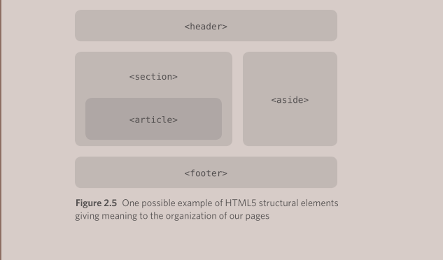
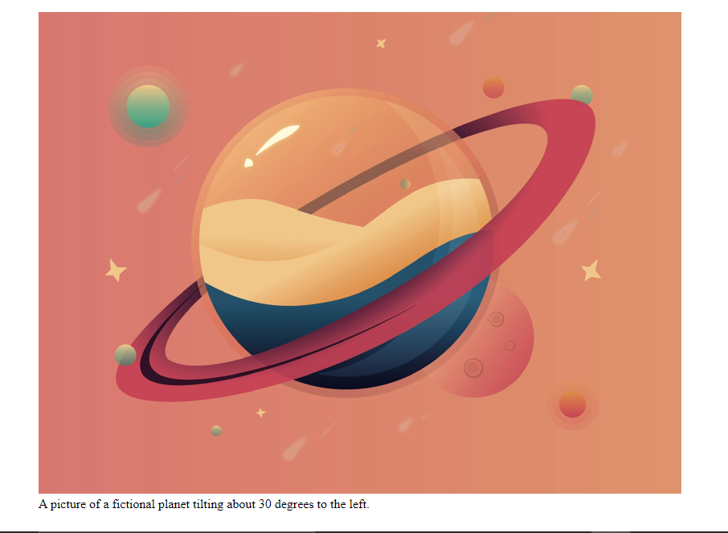
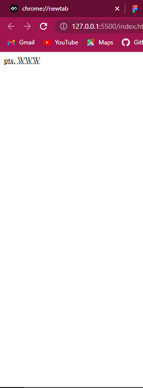
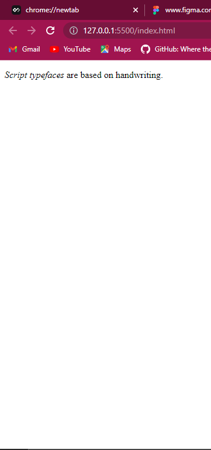
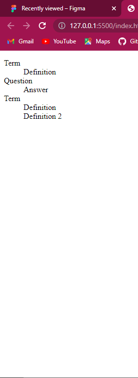

- [References](#references)
- [Introduction](#introduction)
  - [What is HTML?](#what-is-html)
  - [What is HTML5?](#what-is-html5)
  - [HTML: The Living Language](#html-the-living-language)
  - [Principles of HTML5](#principles-of-html5)
  - [Common HTML Terms](#common-html-terms)
    - [How they are used](#how-they-are-used)
  - [Naming Conventions for files](#naming-conventions-for-files)
- [The HTML5 Syntax](#the-html5-syntax)
  - [The HTML Skeleton](#the-html-skeleton)
    - [The Doctype](#the-doctype)
      - [Quirks Mode and Standards Mode](#quirks-mode-and-standards-mode)
    - [Character Encoding](#character-encoding)
    - [Specifying Language](#specifying-language)
    - [The `<head>` element](#the-head-element)
    - [The `<body>` element](#the-body-element)
  - [Syntax Changes](#syntax-changes)
    - [Loosened Rules](#loosened-rules)
    - [Removed Elements](#removed-elements)
    - [Adapted Elements](#adapted-elements)
- [Working with HTML](#working-with-html)
  - [Comments](#comments)
  - [Block and Inline Elements](#block-and-inline-elements)
  - [Divs and Spans](#divs-and-spans)
  - [Semantic Elements](#semantic-elements)
    - [Structurally-based Elements](#structurally-based-elements)
      - [Header `<header>`](#header-header)
      - [Navigation `<nav>`](#navigation-nav)
      - [Main `<main>`](#main-main)
      - [Article `<article>`](#article-article)
      - [Section `<section>`](#section-section)
      - [Aside `<aside>`](#aside-aside)
      - [Footer `<footer>`](#footer-footer)
      - [Addresses `<address>`](#addresses-address)
    - [Using Text-Based Elements](#using-text-based-elements)
      - [Headings `<h1>` to `<h6>`](#headings-h1-to-h6)
      - [Heading Groups `<hgroup>`](#heading-groups-hgroup)
      - [Paragraphs `<p>`](#paragraphs-p)
      - [Bold Text (`<strong>` and `<em>`)](#bold-text-strong-and-em)
      - [Italic Text (`<em>` and `<i>`)](#italic-text-em-and-i)
      - [Time `<time>`](#time-time)
      - [Figure, `<figure>` and `<figcaption>`](#figure-figure-and-figcaption)
      - [Output `<output>`](#output-output)
      - [Mark `<mark>`](#mark-mark)
      - [Blockquotes `<blockquote>` (for long quotations)](#blockquotes-blockquote-for-long-quotations)
      - [Short quotations `<q>`](#short-quotations-q)
      - [Pre-formatted text `<pre>`](#pre-formatted-text-pre)
      - [Abbreviations `<abbr>`](#abbreviations-abbr)
      - [Citations `<cite>`](#citations-cite)
      - [Defining terms `<dfn>`](#defining-terms-dfn)
      - [Subscript and superscript, `<sub>` and `<sup>`](#subscript-and-superscript-sub-and-sup)
      - [Elements for code](#elements-for-code)
      - [Machine-readable data `<data>`](#machine-readable-data-data)
    - [Other Elements](#other-elements)
      - [Lists](#lists)
        - [Unordered Lists](#unordered-lists)
        - [Ordered Lists](#ordered-lists)
        - [Description Lists](#description-lists)
    - [Other Standards for Semantics](#other-standards-for-semantics)
  - [General HTML Elements](#general-html-elements)
    - [Creating Hyperlinks](#creating-hyperlinks)
      - [The anchor `<a>` element](#the-anchor-a-element)
      - [Relative and Absolute Paths](#relative-and-absolute-paths)
      - [Linking Email Addresses](#linking-email-addresses)
      - [Open Links in a New Window](#open-links-in-a-new-window)
      - [Linking to parts of the same page](#linking-to-parts-of-the-same-page)
- [Web Forms](#web-forms)

# References
> HTML5: The Missing Manual, *2nd Edition* by Matthew MacDonald  
> 
> Learn to Code HTML and CSS: Develop and Style Websites by Shay Howe 
>  
> Learning Web Design: A Beginner's Guide to HTML, CSS, JavaScript and Web Graphics, *4th Edition* by Jennifer Niederst Robbins
> 
>> **All screenshots of the exercises tried out are from the Google Chrome browser, version 104.0.5112.102**

# Introduction

## What is HTML?
HTML stands for the *HyperText Markup Language*.  It is the (markup) language used to create web page documents. 

A markup language is basically used for formatting documents or (web) content. It gives content structure and meaning by adding descriptive tags to the document.

HTML defines text elements that make up documents such as headings, paragraphs, emphasized text, links, etc.

## What is HTML5?
HTML5 is really a web of interrelated standards. 
1. **Core HTML5** - This makes up the official W3C version of the specification. It includes new semantic elements, new and enhanced web form widgets, audio and video support, and the canvas for drawing with JavaScript.
2. **Features that were once HTML5** - Features that sprang form the original HTML5 spec as prepared by the WHATWG. These are mostly specifications for features that require JS and support rich web applications - data storage, offline applications and messaging.
3. **Features that are sometimes called HTMl5** - Next-gen features often lumped together with HTML5, even though they were never a part of the standard - CSS3 and geolocation.

## HTML: The Living Language
This means that an HTML page will never become obsolete and stop working. HTML pages will never use a version number, and developers will never need to 'upgrade' their markup from one version to another.  
By the same token, new features may be added to HTML at any time.

## Principles of HTML5
1. **Don't Break the Web**: A standard shouldn't introduce changes that makes other people's web pages stop working.  
2. **Pave the cowpaths**: HTML5 standardizes unofficial, but widely used techniques.
3. **Be practical**: Changes should have a practical purpose. The more demanding a change, the bigger the payoff needs to be.

## Common HTML Terms
1. **Elements**: Elements consist of both the content and the tags surrounding the content.

2. **Tags**: Tags comprise of the use of less-than and greater-than angle brackets surrounding an element. Tags mostly occur in pairs of opening and closing tags.

3. **Attributes**: Properties used to add additional information about an element. Attributes are defined within the opening tag, after an element's name. They generally include a name an a value. Examples are 
  * `class`: Classifies an element
  * `id`: Identifies an element
  * `src`: Specifies a source for an embeddable content.
  * `href`: Provides a hyperlink reference to a linked resource

### How they are used

```html
<a href="https://google.com">Google</a>
<element-name attribute="attribute-value">Element Content</element-name>
```
* `<a>` - the opening tag
* `a` - element name
* `href` - attribute (the hyperlink reference attribute)
* `https://google.com` - the attribute value
* `Google` - element content
* `</a>` - closing tag

* `<a>...</a>` - element

## Naming Conventions for files
1. Use proper suffixes: HTML and XHTML files must end with `.html`. Web graphics must be labelled according to their format, `.gif`, `.png`, `.jpg`, `.jpeg`, etc.

2. Never use character spaces within filenames: An underline or hyphen is often used to visually seperate words within filenames.

3. Avoid special characters: Filenames should be limited to letters, nimbers, underscores, hyphens, and periods.

4. Filenames may be case-sensitive, depending on server configuration: It is preferable to consistently use all lowercase letters in filenames.

5. Keep filenames short, as much as you can. 

# The HTML5 Syntax

## The HTML Skeleton
The simplest HTML5 document you can create
```html
<!DOCTYPE html>
  <title>Document</title>
  <p>Learning to use HTML5</p>
```

This is more fleshed out
```html
<!DOCTYPE html>
<html lang="en">
<head>
  <meta charset="UTF-8">
  <meta http-equiv="X-UA-Compatible" content="IE=edge">
  <meta name="viewport" content="width=device-width, initial-scale=1.0">
  <title>Document</title>
</head>
<body>
  <p>Learning to use HTML5</p>
</body>
</html>
```
### The Doctype
`<!DOCTYPE html>`

The doctype clearly indicates the standard that was used to write the document markup that follows.  It indicates what version of HTML is being used and is placed at the beginning of the HTML document.
Despite the fact that HTML is a living language, the doctype remains. Without a doctype, most browsers will lapse into *quirks mode*, which differs from browser to browser.  
When you add a doctype, the browser recognises that you want to use the stricter standards mode, ensuring consistent formatting and layout on every modern browser.

Other agents such as HTML5 validators, search engines, design tools, and other human beings also make use of the doctype to determine what flavor of markup you're using.


#### Quirks Mode and Standards Mode


### Character Encoding
`<meta charset="UTF-8">`

A standard that tells a computer how to convert your text into a sequence of bytes when it's stored in a file, and how to convert it back again when the file is opened.

Traditionally, on (English) websites, the encoding used is called **UTF-8**. It's compact, fast and supports all on-English characters you could need.

### Specifying Language
`<html lang="en">`

It's advisable to specify the language used for the web page. This is useful, especially for search engines when filtering search results.  
This can also help screen readers if a page has text from multiple languages, by indicating the languages of different sections.

To specify the language of content, you can add the `lang` attribute to any element, along with the appropriate language code.

### The `<head>` element
Identifies the top of the document, and includes any metadata. The content in the `<head>` is not displayed on the web page.
The document title is also included here and is displayed om the tile bar in the browser window. It also includes links to external files.

### The `<body>` element
All visible content appears here.

## Syntax Changes

### Loosened Rules
1. The `<html>`, `<head>` and `<body>` elements are optional. However, they are pretty useful so best to keep in.
2. Capitalization, when writing tags, is ignored. So `<EM></eM>` is allowed.
3. The closing slash can be omitted from a *void element*. *Void elements are elements with no nested content. Examples are `<br>`, `` and `<hr>`* So `<br>`, `<br />` and `<br/>` are valid.
4. Attributes do not require quotation marks unless it contains a restricted character (such as >, = or a space).
   ``
5. Attributes with no values are allowed. So
   `<input type="checkbox" checked="checked">` and
   `<input type="checkbox" checked>` are valid.

### Removed Elements
1. **Presentational Elements (and Attributes)**: These are elements simply there to add formatting. Examples include `<strike>`, `<big>`, `<center>`, `<font>`, `<tt>`.
2. `<frames>` replaced by  `<iframe>`; used for displaying a web page in another web page.
3. `<acronym>` replaced by `<abbr>`
4. `<applet>` replaced by `<object>`

### Adapted Elements
Elements adapted to a new purpose.

1. `<small>` now represents small print, e.g legalese at the bottom of a contract.
2. `<hr>` represents a thematic break - a transition to another topic.
3. `<s>` represents text no longer accurate or relevant.
4. `<strong>` represents text with strong importance; text that needs to stand out from its surroundings.
5. `<b>` represents text that should be bold but has no greater important than the rest of the text. Could include keywords, product names, anything else that would be bold in print.
6. `<em>` represents with emphatic stress; text that might have a different inflection when read out loud.
7. `<i>` for italic text with no greater importance.

# Working with HTML

## Comments
```html
<!--This is a comment in HTML-->
```

```css
/*This is a comment in CSS*/
```

Any content wrapped in a comment is not displayed on the web page.

## Block and Inline Elements
*Block-level elements* begin on a new line, stacking on top of each other, and occupy any available width. Block-level elements may be nested inside one another and may wrap inline-level elements. They are mainly used for larger pieces of content.

*Inline-level elements* do not begin on a new line. They fall into the normal flow of a document, lining up one after the other, and only maintain the width of their content. Inline-level elements may be nested inside one another, but cannot wrap block-level elements.

## Divs and Spans
Divisions `<div>` and spans `<span>` are HTML elements that act as containers solely for styling purposes. They actually don't hold any semantic value.

A `<div>` is a block-level element that is commonly used to identify large groupings of content.

A `<span>` is an inline-level element commonly used to identify smaller groupings of text within a block-level element.

Divs and spans are commonly used with `class` or `id` attributes for styling purposes.


## Semantic Elements
*Semantics*, within HTML, is the practice of giving content on the page meaning and structure by using the proper element.

Semantic code describes the value of content on a page, regardless of the style or appearance of the element.

### Structurally-based Elements

These are all block-level elements that do not have any implied position or style. They can be used multiple times per page, so long as it reflects the proper semantic meaning.



#### Header `<header>`

The `<header>` element is used to identify the top of a page, article, section, or other section of a page. The `<header>` element may include a heading, introductory text, and even navigation.

```html
<!--Possible Section Header-->
<header>
  <h1>This is a header</h1>
</header>

<header>
<!--Typical Page Header-->
  <nav>
    <ul>
      <li>Home</li>
      <li>About Us</li>
      <li>Contact Us</li>
    </ul>
  </nav>
</header>
```

#### Navigation `<nav>`
The `<nav>` element identifies a section of major navigational links on a page. It's usually reserved for primary navigation sections only, such as global navigation, a table of contents, previous/next links.

Commonly, links within the `<nav>` element link to other pages within the same website or to other parts of the same web page. Miscellaneous one-off links should be wrapped in the anchor `<a>` element.

```html
  <nav>
    <ul>
      <li>Home</li>
      <li>About Us</li>
      <li>Contact Us</li>
    </ul>
  </nav>
```

#### Main `<main>`
The `<main>` element identifies a web page's primary content, not just a portion of important content inside your document. 

You can't put the `<main>` element inside the `<article>` element or any other semantic element.

The `<main>` element can only be used in a page. It often excludes content like headers and footers.

#### Article `<article>`

The `<article>` element is used to identify a section of self-content that may be independently distributed or reused. It's often used to mark up blog posts. newspaper articles, user-submitted content (e.g forum posts), etc.

To decide if the `<article>` tag should be used, the content should be such that could be replicated elsewhere without any confusion. If the content  is removed from the context of the page and placed somewhere else, it should still make sense.

#### Section `<section>`

The `<section>` element is used to identify a thematic grouping of content, that is content that makes sense to be together under a certain sub-heading or as sub-headings or discussions under a particular topic. 

The content placed in the `<section>` element should make sense as contributing as a part of a whole topic. It is commonly used to break up and provide hierarchy to a page, and usually contains a heading.


#### Aside `<aside>`

The `<aside>` element holds information that is tangentially related to the content surrounding it. Example: sidebars, inserts or brief explanation.

The `<aside>` element can be thought of as appearing to the left or right side of a page.

#### Footer `<footer>`
The `<footer>` element identifies the end of a page, article, section or other segment of a page.

#### Addresses `<address>`
The `<address>` element is used to create an area for the contact information for the author or maintainer of the document.
It is generally placed at the emd of the document, section, or article. Most likely placed in the footer.

Should be used solely for the author's info.

### Using Text-Based Elements

#### Headings `<h1>` to `<h6>`
Headings are block-level elements, and they come in six different rankings, `<h1>` through `<h6>`. They are used to establish hierarchy.

Headings should be used in an order relevant to the content of a page. The primary heading of a page or section should be marked up with an `<h1>` elements, and subsequent headings should use `<h2>` through `<h6>` elements as necessary.

```html
<h1>Heading Level 1</h1>
<h2>Heading Level 2</h2>
<h3>Heading Level 3</h3>
<h4>Heading Level 4</h4>
<h5>Heading Level 5</h5>
<h6>Heading Level 6</h6>
```


#### Heading Groups `<hgroup>`
The `<hgroup>` element is used to wrap an a group of headings. It is especially used when there is a subheading. 

The highest-ranked heading is used in the document outline.

```html
  <hgroup>
    <h1>Creating a Simple Page</h1>
    <h2>(HTML Overview)</h2>
  </hgroup>
```

#### Paragraphs `<p>`
Paragraphs are defined using the `<p>` block-level element.

```html
<p>Social norm: A pattern of behavior in a particular group, community, or culture, accepted as normal to which an individual is expected to conform.</p>

<p>Counterculture: a way of life and set of attitudes opposed to or at variance with the prevailing social norm.</p>
```


**Note: Text that is not contained within tags is called *naked* or *anonymous text*.**

#### Bold Text (`<strong>` and `<em>`)
These are both inline elements. 

The `<strong>` element is semantically used to give strong importance to text.

The `<b>` element is used to stylistically offset text.

They however look very similar.

```html
<!--Strong Importance-->
<p><strong>Caution:</strong> Falling Rocks.</p>

<!--Stylistically Offset-->
<p>This recipe calls for <b>bacon</b> and <b>mayonnaise</b>. </p>
```


#### Italic Text (`<em>` and `<i>`)
The `<em>` element is used semantically to place a stressed emphasis on text.

The `<i>` element is used semantically to convey text in an alternative voice or tone, almost as if it were placed in quotation marks.

They however look very similar.
```html
<!--Stressed emphasis-->
<p>I <em>love</em> Chicago</p>

<!--Alternative voice or tone-->
<p>The name <em>Shay</em> means a gift.</p>
```

#### Time `<time>`

The `<time>` element flags valid date or time. It has no built-in formatting. It is to be used for precise, not vague, dates.

The `<time>` element performs two roles;
1. Indicates where the date or time value is in the markup
2. It provides the date or time value in a form that any software program can understand.

The `datetime` attribute provides the format for the system to properly decipher. Time indicated with reference to the Greenwich Mean Time (GMT). e.g `-04:00` means 4 hours behind GMT.

The `pubdate` attribute is a boolean attribute that indicates that the date is the publication date of the current content.

When indicating time zones, users get the time in a format they expect.

```html
<!--Dates-->
Registration begins on <time>2014-11-25</time>

The party starts <time datetime="2014-03-21">March 21<sup>st</sup></time>.

<!--Times (uses the 24-hour clock)-->
The party starts at <time datetime="16:30">4:30pm</time>.

<!--Date and Time-->
The party starts <time datetime="2014-03-21 16:30">March 21<sup>st</sup> at 4:30pm</time>.

The party starts <time datetime="2014-03-21T16:30">March 21<sup>st</sup> at 4:30pm</time>.

<!--Time Zones(with reference to UTC)-->
The party starts <time datetime="2014-03-21 16:30-05:00">March 21<sup>st</sup> at 4:30pm</time>. <!--Indicates UTC-5:00-->

<!--The Pubdate attribute-->
Published on <time datetime="2014-03-21" pubdate>March 31, 2014</time>
```
*Note: The `<sup>` element stands for superscript text, and the `<sub>` element stands for subscript text.*

#### Figure, `<figure>` and `<figcaption>`
The `<figure>` element can be thought of as a picture that's seperate from the text, yet referred to in the text.
Figures often have captions.
In cases where the figcaption includes a complete description of the image, the `alt` attribute can be removed from the `` element.

A figure could also contain a video, a code snippet, text or a table. A figure should be treated and referenced as a self-contained unit - content that if removed from its original placement in the main flow, the figure and the main flow would still make sense.

```html
  <figure>
    
    <figcaption>A picture of a fictional planet tilting about 30 degrees to the left.</figcaption>
```


#### Output `<output>`
The `<output> `element is a placeholder your code can use to show a piece of calculated information.

#### Mark `<mark>`
The `<mark>` element represents a section of text that's highlighted for reference. It's appropriate when quoting someone's text and you want to bring attention to something.

It can also be used to flag important content or keywords, or to make up document changes, in combination with `<del>` and `<ins>`.

By default, text in the `<mark>` element is highlighted with a bright yellow background.

*Note: The `<del>` element is used to indicate deleted text, and `<ins>` is used to indicate inserted text.*

#### Blockquotes `<blockquote>` (for long quotations)
The `<blockquote>` element is used to mark up long quotations, testimonials, or sections of copy from another source. 
It is recommended that the content in a blockquote should be contained within other elements.[See sectioning roots]

```html
  <p>Someone has something to say:</p>

  <blockquote>
    <p>This is the first line of text in the quote.</p>

    <p>This is the second, and an even longer, line of text in the quote.</p>
  </blockquote>
```


#### Short quotations `<q>`
```html
<p>
  I said, <q>"This is a short quote."</q>
</p>
```
**Note: Browsers should automatically add quotation marks around `<q>` and `<blockquote>` elements, so you don't have to include them in the source document.**


#### Pre-formatted text `<pre>`
Text within the `<pre>` element retain source formatting.
The text retains all the whitespace - it is displayed exactly as it is typed, and with a fixed-width font.


#### Abbreviations `<abbr>`
The `<abbr>` element is used for abbreviations and acronyms.

**Abbreviations** are shortened versions of a word ending with a period. Example: Conn. for Connecticut.

**Acronyms** are abbreviations formed by the first letters of the words in a phrase. Example: WWW.

The `title` element provides the long version of the shortened term.

```html
  <abbr title="Points">pts.</abbr>
  <abbr title="World Wide Web">WWW</abbr>
```


#### Citations `<cite>`
The `<cite>` element is used to identify a reference to another document e.g books, magazines, article, etc.

It is rendered in italics by default.
```html
  <p>The name of the books I used to learn are <cite>Learn to code HTML and CSS</cite> by Shay Howe, <cite>HTML5: The
      Missing Manual</cite> by Matthew MacDonald and <cite>Learning Web Design</cite> by Jennifer Niederst Robbins.</p>
```


#### Defining terms `<dfn>`
The `<dfn>` element is used to point out the first and defining instance of a word in a document.
```html
  <p><dfn>Script typefaces</dfn> are based on handwriting.</p>
```


#### Subscript and superscript, `<sub>` and `<sup>`

Typically used with ordinal numbers, mathematical equations and chemical formulas.
```html
  <p>H<sub>2</sub>0</p>
  <p>E = MC<sup>2</sup></p>
```


#### Elements for code
* `<code>` - code
* `<var>` - variables
* `<samp>` - program samples
* `<kbd>` - user-centered keystrokes

They are typically rendered in a constant-width font. Variables are rendered in italics.

#### Machine-readable data `<data>`
The `<data>` element helps computers make sense of content. It can be used for all sorts of data, including dates, times, measurements, weights, etc.

It makes use of the `value` attribute.
```html
<data value="12">Twelve</data>
<data value="2011-11-12">Last Saturday</data>
```

### Other Elements

#### Lists

All list elements are displayed as block elements by default.

##### Unordered Lists
List items appear in no particular order. Each list item is displayed with a bullet before it.

```html
<ul>
  <li><a href="#">List Item 1</a></li>
  <li><a href="#">List Item 2</a></li>
  <li><a href="#">List Item 3</a></li>
  <li><a href="#">List Item 4</a></li>
  <li><a href="#">List Item 5</a></li>
</ul>
```


##### Ordered Lists
List items appear in an ordered sequence.

```html
<ol>
  <li><a href="#">List Item 1</a></li>
  <li><a href="#">List Item 2</a></li>
  <li><a href="#">List Item 3</a></li>
  <li><a href="#">List Item 4</a></li>
  <li><a href="#">List Item 5</a></li>
</ol>
```


To start from a number other than one (1), you can use the `start` attribute to specify another starting number.
```html
  <ol start="11">
    <li><a href="#">List Item 11</a></li>
    <li><a href="#">List Item 12</a></li>
    <li><a href="#">List Item 13</a></li>
    <li><a href="#">List Item 14</a></li>
    <li><a href="#">List Item 15</a></li>
  </ol>
```


##### Description Lists
These lists contain name and value pairs. Description lists can be used for terms and definitions, questions and answers, etc.

```html
  <dl>
    <dt>Term</dt>
    <dd>Definition</dd>

    <dt>Question</dt>
    <dd>Answer</dd>

    <dt>Term</dt>
    <dd>Definition</dd>
    <dd>Definition 2</dd>
  </dl>
```



**Note: Any list can be nested within another list, it just has to be placed within a list item.**
```html
  <ol>
    <li></li>
    <li>
      <ul>
        <li></li>
        <li></li>
        <li></li>
      </ul>
    </li>
    <li></li>
  </ol>
```

### Other Standards for Semantics
1. **Accessible Rich Internet Applications (ARIA)**: This is a developing standard that lets you supply extra info for screen readers through attributes on any HTML element. It introduces the `role` attribute, which indicates the purpose of a given element.

2. **Resource Description Framework (RDFa)**: A standard for embedding detailed metadata into your web documents using attributes. It's a settled, stable standard.

3. **Microformats**: A simple, streamlined approach to putting metadata in your pages. They're a loose collection of agreed-upon conventions that lets pages share structured info. It piggybacks on the `class` attribute.

4. **Microdata**: Imports its own attributes.
## General HTML Elements

### Creating Hyperlinks

#### The anchor `<a>` element

The `<a>` element is used to create hyperlinks. Hyperlinks provide the ability to link from one web page or resource to another.

To create a link, the `href` attribute (a hyperlink reference) is required. The `href` attribute identifies the destination of the link.

`<a href="http://shayhowe.com">Shay</a>`


The `<a>` element is an inline element. However, with the introduction of HTML5, anchor elements can wrap block, inline or other level elements.

#### Relative and Absolute Paths

Links pointing to other pages of the same website have a *relative path*. The `href` attribute needs to include the file name and/or directory as the case may be.

Links pointing to other websites require an absolute path. The `href` attribute needs to include the full domain.

```html
<!------Absolute Paths------>
<a href="http://www.google.com">Google</a>

<!-----Relative Paths------>

<!--If file is in the same folder-->
<a href="about.html">About</a> 

<!--If file is in the same folder-->
<a href="about.html">About</a> 
```
#### Linking Email Addresses

```html
<a href="mailto:umana.mmedara@gmail.com">Email Me</a>

<!--To add a subject line (Reaching Out)-->
<a href="mailto:umana.mmedara@gmail.com?subject=Reaching20%Out">Email Me</a>

<!--To add body text (How are you)-->
<a href="mailto:umana.mmedara@gmail.com?subject=Reaching20%Out&body=How%20are%20you">Email Me</a>
```

The `?` after the email address is necessary to bind the next parameter to the hyperlink path.

The `&` after the `subject` parameter is to seperate the `body` parameter from it.

Spaces are encoded using `%20` and line breaks are encoded using `%0A`.    

#### Open Links in a New Window

`<a href="http://google.com" target="_blank">Google</a>`

Hyperlinks have the ability to determine where a link opens when clicked. This requires the `target` attribute. 

The `_blank` value indicates a new window.

#### Linking to parts of the same page

This required the use of an `id` attribute on the element you're trying to link to.

```html
<body id="top">
...
<a href="#top">Back to top</a>
...
</body>
```

# Web Forms

